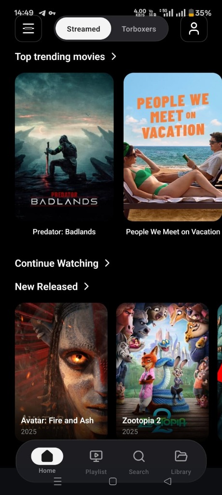
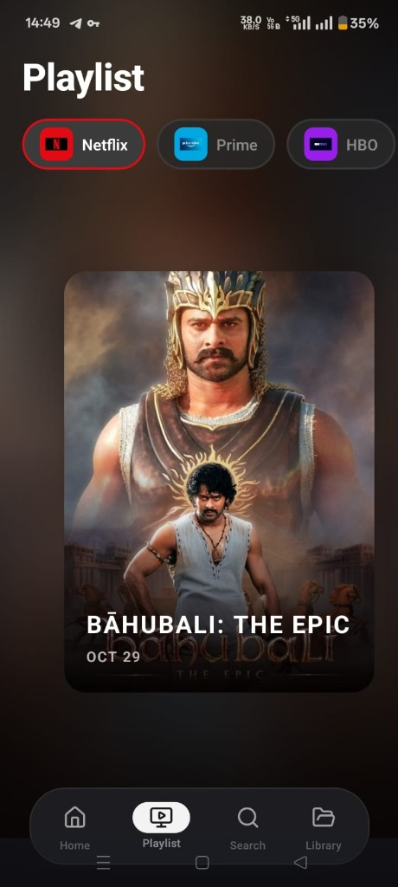
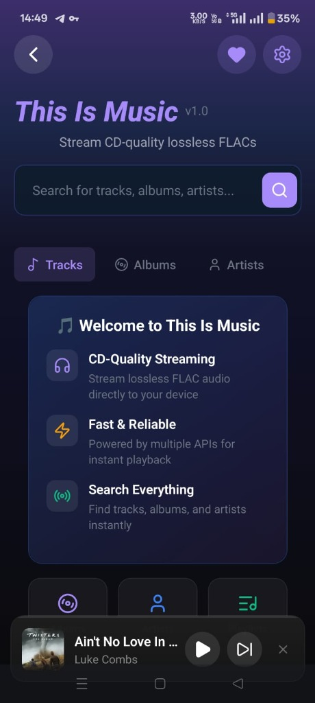
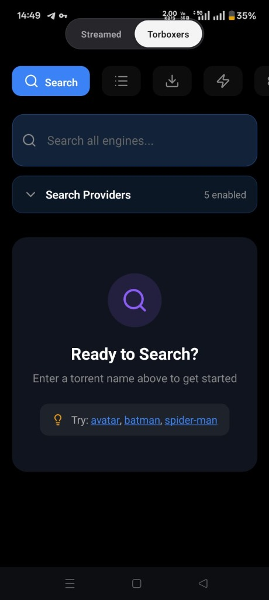

<p align="center">
  
</p>

<h1 align="center">🎬 STREAMED</h1>

<p align="center">
  <strong>The Ultimate All-in-One Entertainment App</strong><br>
  <em>Movies • TV Shows • Hi-Fi Music • Debrid • Addons</em>
</p>

<p align="center">
  
  
  
  
  
</p>

<p align="center">
  <a href="#-features">Features</a> •
  <a href="#-torbox-integration">TorBox</a> •
  <a href="#-torboxers">Torboxers</a> •
  <a href="#-stremio-addons">Addons</a> •
  <a href="#-hi-fi-music">Music</a> •
  <a href="#-installation">Install</a>
</p>

---

## 🎯 What is Streamed?

**Streamed** is a premium, feature-packed Android app that combines everything you need for entertainment:

```
┌─────────────────────────────────────────────────────────────────┐
│                                                                 │
│   🎬 Movies & TV Shows    🎵 Hi-Fi Music    ⚡ Instant Debrid   │
│                                                                 │
│   🔌 Stremio Addons       🔍 Torrent Search  📥 Downloads       │
│                                                                 │
└─────────────────────────────────────────────────────────────────┘
```

> **One app. Unlimited entertainment. Zero compromise.**

---

## 📸 Demo

<p align="center">
  
  
  
  
</p>

---

## ✨ Features

### 🎬 Movies & TV Shows
| Feature | Description |
|---------|-------------|
| **TMDB Integration** | Rich metadata, posters, backdrops, cast info |
| **Smart Search** | Real-time search with filtering |
| **Season Packs** | Auto-parse and pick individual episodes |
| **Watch History** | Resume where you left off |
| **Favorites** | Quick access to your top picks |
| **Coming Soon** | Stay updated on new releases |

### 📺 VLC-Powered Video Player
```
┌────────────────────────────────────────────┐
│  ▶️  Universal Format Support              │
│  🔊  Multiple Audio Tracks                 │
│  📝  Built-in Subtitles                    │
│  📱  Picture-in-Picture                    │
│  🔒  Screen Lock                           │
│  ⚡  Variable Speed (0.25x - 2.0x)         │
│  👆  Seek Gestures                         │
└────────────────────────────────────────────┘
```

---

## ⚡ TorBox Integration

Full **TorBox debrid** integration at the core:

```
                    ┌──────────────────┐
                    │     TorBox       │
                    │   ⚡ Debrid ⚡    │
                    └────────┬─────────┘
                             │
        ┌────────────────────┼────────────────────┐
        │                    │                    │
        ▼                    ▼                    ▼
┌───────────────┐   ┌───────────────┐   ┌───────────────┐
│ Instant Cache │   │   Library     │   │   Dashboard   │
│   Streaming   │   │  Management   │   │    Stats      │
└───────────────┘   └───────────────┘   └───────────────┘
```

- ✅ **Instant Cached Streaming** — If cached, play immediately
- ✅ **Cache Status Indicators** — Know what's instant before selecting
- ✅ **Real-time Progress** — Speed, ETA, completion alerts
- ✅ **Library Management** — View/delete torrents in-app
- ✅ **Account Dashboard** — Subscription & usage stats

---

## 🔍 Torboxers

The most powerful torrent search engine in any streaming app:

```
    ╔══════════════════════════════════════════════════════╗
    ║                    TORBOXERS                         ║
    ╠══════════════════════════════════════════════════════╣
    ║                                                      ║
    ║   🔍 Multi-Engine Search                             ║
    ║      └── Query multiple indexers simultaneously      ║
    ║                                                      ║
    ║   📋 YAML Engine Configs                             ║
    ║      └── Import/create custom search engines         ║
    ║                                                      ║
    ║   ⚡ Cached-Only Filter                              ║
    ║      └── Show only instantly streamable results      ║
    ║                                                      ║
    ║   ▶️  Direct to Playback                             ║
    ║      └── One tap from result to watching             ║
    ║                                                      ║
    ║   📁 File Browser                                    ║
    ║      └── Pick specific files from season packs       ║
    ║                                                      ║
    ║   📥 Download Manager                                ║
    ║      └── Download files with progress tracking       ║
    ║                                                      ║
    ╚══════════════════════════════════════════════════════╝
```

---

## 🔌 Stremio Addons

**Full compatibility** with the Stremio ecosystem:

| Addon | Status | Description |
|-------|:------:|-------------|
| 🔥 **Torrentio** | ✅ | Popular torrent indexer |
| ☄️ **Comet** | ✅ | Fast indexer with debrid |
| 🌀 **MediaFusion** | ✅ | Multi-source aggregator |
| 🚀 **StremThru** | ✅ | Debrid proxy service |
| 🎯 **Jackettio** | ✅ | Jackett integration |
| 💍 **Annatar** | ✅ | Fast torrent indexer |
| ⚔️ **KnightCrawler** | ✅ | Torrent crawler |
| ➕ **Custom** | ✅ | Any manifest URL! |

> **Just paste your configured manifest URL and you're ready!**

---

## 🎵 Hi-Fi Music

Premium music streaming built right in:

```
    ┌─────────────────────────────────────────────────┐
    │                                                 │
    │   🎵 TIDAL        Master (24-bit MQA)           │
    │                   Lossless (16-bit FLAC)        │
    │                                                 │
    │   🎵 Qobuz        Hi-Res Streaming              │
    │                                                 │
    │   🎵 Subsonic     Connect Your Own Server       │
    │                                                 │
    └─────────────────────────────────────────────────┘

    Features:
    ├── 🔊 Background Playback
    ├── 📱 Notification Controls
    ├── 🔀 Queue Management
    ├── 🔁 Shuffle & Repeat
    ├── 👤 Artist/Album Browsing
    ├── 📋 Playlist Support
    └── 🎨 Dynamic Colors from Album Art
```

---

## 🧲 Magnet Manager

```
┌────────────────────────────────────────────────────┐
│              ADD TORRENT                           │
├────────────────────────────────────────────────────┤
│                                                    │
│  📋 Paste magnet links or hashes                  │
│  📦 Batch add (multiple at once)                  │
│  📊 Live caching progress with speed/ETA          │
│  🔔 Completion notifications                       │
│  🗑️ Delete from history or TorBox                 │
│                                                    │
└────────────────────────────────────────────────────┘
```

---

## 🌐 Additional Features

| Feature | Description |
|---------|-------------|
| **DNS-over-HTTPS** | Multiple DoH providers (Cloudflare, Google, Quad9) |
| **Watch History** | Synced progress across sessions |
| **Library System** | Personal collection management |
| **Dark Theme** | Premium aesthetic with glassmorphism |
| **Smooth Animations** | 60fps throughout |
| **Gesture Controls** | Intuitive navigation |

---

## 📱 Requirements

```yaml
Platform: Android 8.0+ (Oreo, SDK 26+)
TorBox: API key required (free tier available)
Addons: Configure on respective websites, paste manifest URL
```

---

## 📦 Installation

### Option 1: Download APK
1. Go to [Releases](../../releases)
2. Download the latest `.apk`
3. Install on your Android device

### Option 2: Build from Source
```bash
# Clone the repo
git clone https://github.com/chandradev28/streamed.git
cd streamed

# Install dependencies
pnpm install

# Run development build
pnpm start

# Build APK
eas build --platform android --profile preview
```

---

## 🛠️ Tech Stack

```
├── React Native 0.81
├── Expo SDK 54
├── TypeScript
├── LibVLC Player
├── React Native Track Player
├── Expo Image
├── React Navigation
└── AsyncStorage
```

---

## 📜 Changelog

### v1.0.0-beta
- 🎬 Movies & TV Shows with TMDB
- ⚡ TorBox debrid integration
- 🔍 Torboxers search engine
- 🔌 Full Stremio addon support
- 🎵 Hi-Fi music streaming
- 📺 VLC-powered video player
- 🧲 Magnet manager

---

## 🤝 Contributing

This is currently a private project. If you're interested in contributing, please reach out!

---

## 📞 Contact & Support

- **Discord**: [Join our community](#) <!-- Add your Discord link -->
- **Issues**: [Report bugs](../../issues)

---

<p align="center">
  <strong>Made with ❤️ for the streaming community</strong>
</p>

<p align="center">
  
  
  
</p>

---

<p align="center">
  <sub>⚠️ This app is for personal use only. Respect content creators and support official releases.</sub>
</p>
